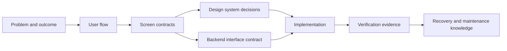

  

  <strong>Turn product intent into interfaces, evidence, and maintainable software.</strong>

  StackForge Atlas is an evidence-backed field guide and lightweight agent harness for designing, building, reviewing, operating, and evolving web applications without losing the reasoning that made them coherent.

  <a href="./docs/START-HERE.md"><strong>Start here</strong></a>
  ·
  <a href="./pilots/order-cancellation-postgres/operational/README.md">Recovery drill</a>
  ·
  <a href="./pilots/order-cancellation-postgres/README.md">Durability pilot</a>
  ·
  <a href="./templates/feature-slice/README.md">Feature slice kit</a>

---

## Software can be generated faster than it can be understood

LLM agents can produce screens, endpoints, migrations, and tests quickly. The hard part is preserving the chain between them:

<table>
  <tr>
    <td width="25%" valign="top"><strong>Intent</strong> The user problem, domain rule, scope, and decision.</td>
    <td width="25%" valign="top"><strong>Interface</strong> The flow, screen states, component behavior, and backend contract.</td>
    <td width="25%" valign="top"><strong>Evidence</strong> The tests, security checks, failure cases, and review findings.</td>
    <td width="25%" valign="top"><strong>Evolution</strong> The source map, recovery procedures, decisions, and maintenance context.</td>
  </tr>
</table>

StackForge Atlas keeps that chain explicit. It is not a giant prompt and it is not another web framework. It is a structured way to make engineering intent legible to people and agents, then verify that the implementation still matches it when the happy path ends.

## One feature, one traceable slice

A feature is ready to build only when its meaningful states and interface boundaries are clear. It is complete only when its acceptance evidence, failure handling, and maintenance context are also clear.

## What Atlas helps teams do

<table>
  <tr>
    <td width="33%" valign="top">
      <h3>Shape the product before the code</h3>
      Turn a vague request into a user flow, stateful wireframe, interaction contract, and explicit non-goals.
    </td>
    <td width="33%" valign="top">
      <h3>Give agents precise freedom</h3>
      Load only the rules and contracts relevant to the task, then let the model solve within verifiable boundaries.
    </td>
    <td width="33%" valign="top">
      <h3>Keep failure recoverable</h3>
      Preserve transaction intent, unfinished work, operator decisions, and recovery evidence instead of relying on memory after an incident.
    </td>
  </tr>
</table>

## From durable to recoverable

The first pilots proved that one order-cancellation contract could survive implementation and application-instance replacement. The operational recovery drill now exercises what happens after the database process is terminated, a migration reaches retained data, a logical backup is restored into a separate database, or an external result remains unknown.

The drill preserves the product contract while measuring recovery time, comparing committed records before and after restart, testing a guarded migration rollback, and giving quarantined cancellations an explicit operator resolution path. It remains deliberately bounded: a single-container volume restart and logical restore do not prove host loss, point-in-time recovery, replication, or failover.

Explore the [operational recovery drill](./pilots/order-cancellation-postgres/operational/README.md), review the [PostgreSQL pilot](./pilots/order-cancellation-postgres/README.md), or read the [cross-stack protocol](./docs/CROSS-STACK-PILOTS.md).

## Working principles

> **Contracts over screenshots. States over happy paths. Evidence over confidence. Maps over memory. Recovery over assumption.**

StackForge Atlas deliberately keeps the always-on agent rules small. Detailed guidance is loaded only when a task needs it, while schemas, CI, and executable drills enforce the parts that should not depend on memory.

## Project status

The repository is in its PostgreSQL operational-recovery stage. The current evidence covers process restart on a retained volume, forward migration, guarded rollback, logical backup and restore, and operator reconciliation. Point-in-time recovery, host-level loss, replication, failover, and production provider integration remain separate gates.

Begin with the [guided entry point](./docs/START-HERE.md), run the [recovery drill](./pilots/order-cancellation-postgres/operational/README.md), and inspect the [PostgreSQL profile](./packs/data-stores/postgresql/README.md) before generalizing the pattern to another engine.
