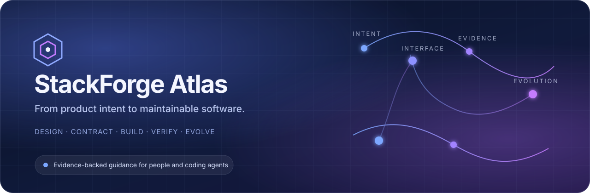
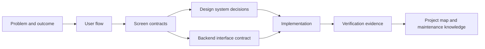

  

  <strong>Turn product intent into interfaces, evidence, and maintainable software.</strong>

  StackForge Atlas is an evidence-backed field guide and lightweight agent harness for designing, building, reviewing, and evolving web applications without losing the reasoning that made them coherent.

  <a href="./docs/START-HERE.md"><strong>Start here</strong></a>
  ·
  <a href="./pilots/order-cancellation-node/README.md">Runnable pilot</a>
  ·
  <a href="./templates/feature-slice/README.md">Feature slice kit</a>
  ·
  <a href="./examples/order-cancellation/README.md">Contract example</a>

---

## Software can be generated faster than it can be understood

LLM agents can produce screens, endpoints, migrations, and tests quickly. The hard part is preserving the chain between them:

<table>
  <tr>
    <td width="25%" valign="top"><strong>Intent</strong> The user problem, domain rule, scope, and decision.</td>
    <td width="25%" valign="top"><strong>Interface</strong> The flow, screen states, component behavior, and backend contract.</td>
    <td width="25%" valign="top"><strong>Evidence</strong> The tests, security checks, failure cases, and review findings.</td>
    <td width="25%" valign="top"><strong>Evolution</strong> The source map, ADRs, runbooks, and maintenance context.</td>
  </tr>
</table>

StackForge Atlas keeps that chain explicit. It is not a giant prompt and it is not another web framework. It is a structured way to make engineering intent legible to people and agents, then verify that the implementation still matches it.

## One feature, one traceable slice

A feature is ready to build only when its meaningful states and interface boundaries are clear. It is complete only when its acceptance evidence and maintenance context are also clear.

## What Atlas helps teams do

<table>
  <tr>
    <td width="33%" valign="top">
      <h3>Shape the product before the code</h3>
      Turn a vague request into a user flow, stateful wireframe, interaction contract, and explicit non-goals.
    </td>
    <td width="33%" valign="top">
      <h3>Give agents precise freedom</h3>
      Load only the rules and contracts relevant to the task, then let the model solve within verifiable boundaries.
    </td>
    <td width="33%" valign="top">
      <h3>Keep the result maintainable</h3>
      Preserve the decisions, source map, operational knowledge, and adversarial review findings that future work depends on.
    </td>
  </tr>
</table>

## The first runnable proof

The initial contract foundation now has a working implementation checkpoint. The Node.js pilot carries one order-cancellation feature from screen states and an OpenAPI contract into a browser surface, protected domain transition, durable operation result, and executable tests.

It is intentionally honest about its boundary: the pilot proves traceability and behavior inside a small process. It does not present fixture authentication or in-memory persistence as production architecture.

Explore the [runnable pilot](./pilots/order-cancellation-node/README.md), review its [project map](./pilots/order-cancellation-node/project-map.yaml), or inspect the [evaluation case](./pilots/order-cancellation-node/evaluation/eval-case.yaml).

## Working principles

> **Contracts over screenshots. States over happy paths. Evidence over confidence. Maps over memory.**

StackForge Atlas deliberately keeps the always-on agent rules small. Detailed guidance is loaded only when a task needs it, while schemas and CI enforce the parts that should not depend on memory.

## Project status

The repository is in its cross-stack pilot stage. The current work is to repeat the same product and interface contract across language, persistence, and maintenance contexts, then promote only failures that recur into shared rules.

Begin with the [guided entry point](./docs/START-HERE.md), run the [Node.js pilot](./pilots/order-cancellation-node/README.md), and read the [pilot protocol](./docs/CROSS-STACK-PILOTS.md) before adding another stack.
