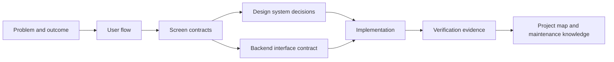

  

  <strong>Turn product intent into interfaces, evidence, and maintainable software.</strong>

  StackForge Atlas is an evidence-backed field guide and lightweight agent harness for designing, building, reviewing, and evolving web applications without losing the reasoning that made them coherent.

  <a href="./docs/START-HERE.md"><strong>Start here</strong></a>
  ·
  <a href="./core/experience/product-interface-delivery.md">Delivery loop</a>
  ·
  <a href="./templates/feature-slice/README.md">Feature slice kit</a>
  ·
  <a href="./examples/order-cancellation/README.md">Worked example</a>

---

## Software can be generated faster than it can be understood

LLM agents can produce screens, endpoints, migrations, and tests quickly. The hard part is preserving the chain between them:

<table>
  <tr>
    <td width="25%" valign="top"><strong>Intent</strong> The user problem, domain rule, scope, and decision.</td>
    <td width="25%" valign="top"><strong>Interface</strong> The flow, screen states, component behavior, and backend contract.</td>
    <td width="25%" valign="top"><strong>Evidence</strong> The tests, security checks, failure cases, and review findings.</td>
    <td width="25%" valign="top"><strong>Evolution</strong> The source map, ADRs, runbooks, and maintenance context.</td>
  </tr>
</table>

StackForge Atlas keeps that chain explicit. It is not a giant prompt and it is not another web framework. It is a structured way to make engineering intent legible to people and agents, then verify that the implementation still matches it.

## One feature, one traceable slice

A feature is ready to build only when its meaningful states and interface boundaries are clear. It is complete only when its acceptance evidence and maintenance context are also clear.

## What Atlas helps teams do

<table>
  <tr>
    <td width="33%" valign="top">
      <h3>Shape the product before the code</h3>
      Turn a vague request into a user flow, stateful wireframe, interaction contract, and explicit non-goals.
    </td>
    <td width="33%" valign="top">
      <h3>Give agents precise freedom</h3>
      Load only the rules and contracts relevant to the task, then let the model solve within verifiable boundaries.
    </td>
    <td width="33%" valign="top">
      <h3>Keep the result maintainable</h3>
      Preserve the decisions, source map, operational knowledge, and adversarial review findings that future work depends on.
    </td>
  </tr>
</table>

## The first foundation

The repository currently starts with the product-interface seam—the place where many generated applications become inconsistent:

- a design-system model that connects tokens, components, patterns, and product surfaces;
- wireframes treated as stateful screen contracts rather than static pictures;
- backend interfaces derived from user intent and domain behavior rather than database tables;
- a traceability matrix connecting visible UI behavior to API operations, rules, errors, and tests;
- adversarial review and validation templates that force unhappy paths into the design before release.

The worked example follows an order-cancellation flow from user intent through screen states and an OpenAPI contract to verification evidence.

## Working principles

> **Contracts over screenshots. States over happy paths. Evidence over confidence. Maps over memory.**

StackForge Atlas deliberately keeps the always-on agent rules small. Detailed guidance is loaded only when a task needs it, while schemas and CI enforce the parts that should not depend on memory.

## Project status

This repository is in its foundation stage. The current goal is to validate the model against real web-application tasks before expanding language, database, infrastructure, and domain packs.

Begin with the [guided entry point](./docs/START-HERE.md), then copy the [feature slice kit](./templates/feature-slice/README.md) for a real task.
