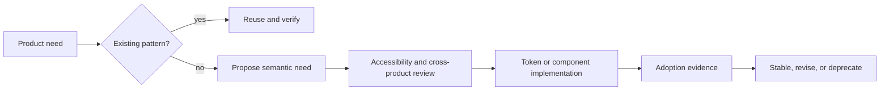

# Design-System Guidance

## Definition

A design system is a governed set of reusable decisions that keeps product behavior, visual language, accessibility, and implementation aligned. It is not a screenshot library, a CSS variable dump, or a component catalogue without ownership.

## Layer model

### 1. Foundations

Raw values and platform constraints: color spaces, type families, scale ratios, spacing, radius, elevation, motion, breakpoints, and density.

### 2. Semantic tokens

Purpose-driven decisions such as `color.action.primary.background`, `color.text.muted`, or `space.control.inline`. Product code should prefer semantic tokens over palette coordinates such as `blue.600`.

Token exchange should follow the DTCG 2025.10 format where practical. The stable format supports typed values, groups, aliases, deprecation metadata, and tool-neutral interchange. Projects may compile tokens to CSS, native platforms, or design tools, but the semantic source remains authoritative.

### 3. Primitives

Low-level accessible building blocks: text, icon, button base, focus ring, stack, grid, surface, field control, and overlay behavior.

### 4. Components

Reusable controls with a defined contract: anatomy, variants, sizes, states, interaction, content limits, accessibility semantics, responsive behavior, and test expectations.

### 5. Patterns

Compositions that solve recurring product problems: search and filter, bulk action, destructive confirmation, async submission, master-detail, onboarding, and permission-gated management.

### 6. Product surfaces

Screens and flows that combine patterns for a domain outcome. Product surfaces may extend the system, but one-off deviations require a recorded reason and an exit strategy.

## Required component contract

Every production component should define:

| Concern | Required decision |
|---|---|
| Purpose | Problem solved and situations where it should not be used |
| Anatomy | Named parts and composition rules |
| Variants | Semantic variants, not cosmetic permutations |
| States | Default, hover, focus, active, disabled, loading, error, selected, and read-only where relevant |
| Interaction | Pointer, keyboard, touch, escape, focus movement, and async behavior |
| Content | Labels, truncation, localization, empty values, and destructive wording |
| Accessibility | Native element preference, name/role/value, focus visibility, announcements, contrast, and target size |
| Responsiveness | Reflow, density, overflow, and small-screen behavior |
| Data | Inputs, outputs, validation ownership, and latency assumptions |
| Evidence | Unit, interaction, accessibility, and visual-regression coverage |
| Lifecycle | Owner, status, version, deprecation, and migration path |

## Accessibility baseline

WCAG 2.2 is the baseline for web content. Component guidance must still translate success criteria into concrete behavior, including keyboard access, visible focus, error identification, target size, consistent help, and alternatives for drag or complex pointer gestures.

Automated accessibility checks are necessary but incomplete. Keyboard walkthroughs, screen-reader-relevant semantics, zoom/reflow, high-contrast behavior, and understandable error recovery require human or scenario-based verification.

## Governance flow

A new component should not be accepted merely because two screens look similar. It should represent repeated behavior with a stable semantic purpose.

## Failure modes to reject

- raw colors and spacing values copied throughout product code;
- tokens named after current appearance rather than semantic purpose;
- components whose API mirrors one screen's internal data model;
- dark mode or localization treated as late styling passes;
- loading, validation, permission, and failure behavior left to each consumer;
- visual snapshots used as the only correctness signal;
- accessibility documented but not included in component tests;
- breaking component changes without migration notes and usage search.

## References

- Design Tokens Format Module 2025.10: <https://www.w3.org/community/reports/design-tokens/CG-FINAL-format-20251028/>
- Design Tokens Resolver Module 2025.10: <https://www.w3.org/community/reports/design-tokens/CG-FINAL-resolver-20251028/>
- WCAG 2.2: <https://www.w3.org/TR/WCAG22/>
