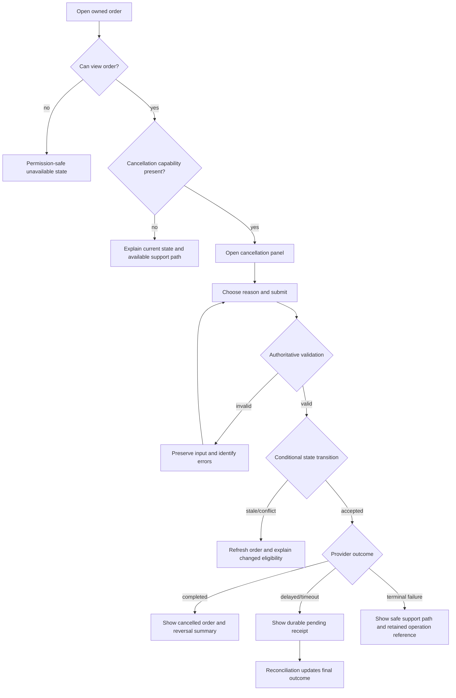

# User Flow — Order Cancellation

## Recovery details

- Refreshing or repeating the request with the same idempotency key returns the existing operation receipt.
- A new idempotency key cannot bypass an existing protected transition.
- Input is preserved for validation errors but cleared after an accepted operation.
- Focus moves to the cancellation result heading after submission.
