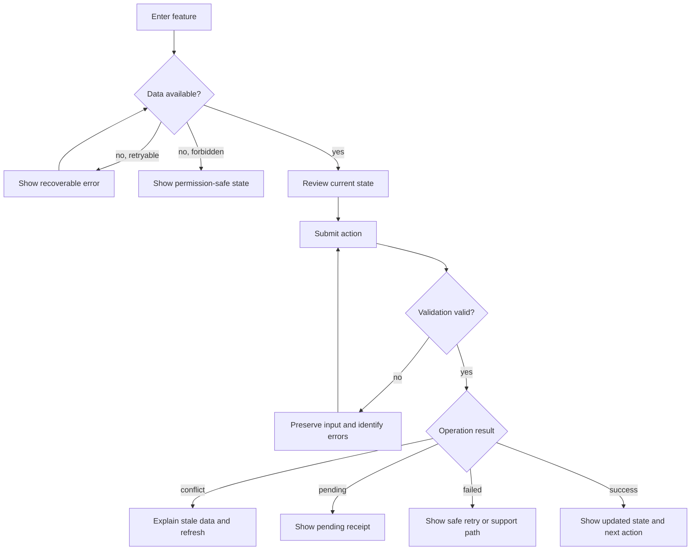

# User Flow — Feature Name

## Preconditions

- Actor is authenticated and has the required object-level permission.
- Required source data is available or the flow defines a recoverable unavailable state.

## Flow

## Exit and recovery rules

- Define where focus moves after each terminal result.
- Define whether input is preserved on failure.
- Define whether browser back, refresh, or repeated submission is safe.
- Define the route or action that returns to the previous context.
